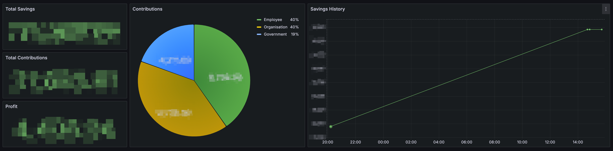

# pensions

Minimalistic Golang client for fetching data from the [Georgian Pension Agency](https://my.pensions.ge).

This repository contains a lightweight Golang client designed to retrieve financial data from the Pension Agency.
The fetched data is stored in an SQL database and is used in a personal Grafana setup for monitoring and analysis:

## TODOs

- [ ] Add CI/CD Workflows.
- [ ] Integrate with [Snyk](https://snyk.io).
- [ ] Fetch and store Assets.
- [ ] Fetch and store Contribution Details.

## Authors

- [**Temuri Takalandze**](https://abgeo.dev) - *Initial work*

## License

Copyright © 2024 [Temuri Takalandze](https://abgeo.dev).  
Released under the [MIT](LICENSE) license.
